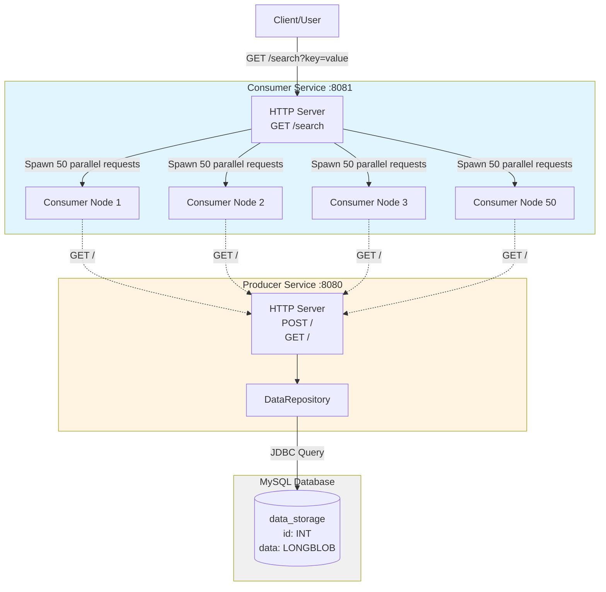
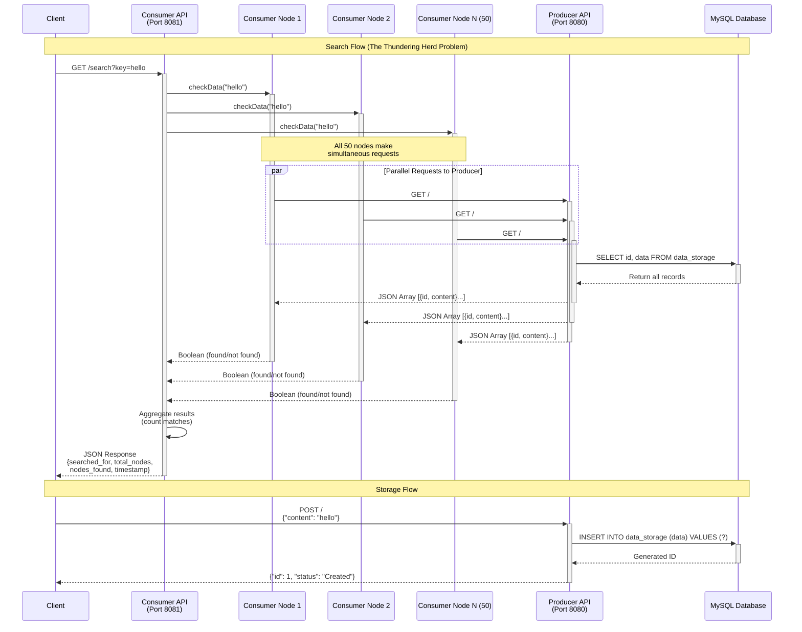

# Vert.x Request Collapser

A demonstration project showcasing request collapsing patterns in distributed systems using Eclipse Vert.x. This project addresses the "Thundering Herd" problem where multiple consumer nodes simultaneously request the same data from a shared producer service.

## Overview

The project consists of two microservices:
- **Producer Service**: A data storage service backed by MySQL that provides RESTful APIs for data persistence and retrieval
- **Consumer Service**: A multi-node consumer that simulates 50 concurrent nodes making search requests to the producer

## Architecture

### Component Diagram



### Sequence Diagram - Data Flow



## Technologies

- **Java 17**
- **Eclipse Vert.x 4.5.1** - Reactive framework for building event-driven applications
- **MySQL 8.3.0** - Database for persistent storage
- **SLF4J + Logback** - Logging framework
- **Maven** - Build and dependency management

## Project Structure

```
vertx-request-collapser/
├── consumer-service/
│   ├── pom.xml
│   └── src/main/java/com/griddynamics/consumer/
│       ├── Launcher.java              # Entry point for consumer service
│       ├── ConsumerVerticle.java      # Main verticle handling HTTP server
│       └── models/
│           └── Node.java              # Individual consumer node logic
│
└── producer-service/
    ├── pom.xml
    └── src/main/java/com/griddynamics/producer/
        ├── Launcher.java              # Entry point for producer service
        ├── ProducerVerticle.java      # Main verticle with REST endpoints
        ├── config/
        │   └── DbConfig.java          # Database configuration
        └── repository/
            └── DataRepository.java    # Data access layer
```

## Services

### Producer Service

The producer service provides a RESTful API for data storage and retrieval backed by MySQL.

**Endpoints:**
- `POST /` - Store new data
  - Request body: `{ "content": "your data here" }`
  - Response: `{ "id": 1, "status": "Created" }`
  
- `GET /` - Retrieve all stored data
  - Response: Array of `{ "id": 1, "content": "stored data" }`

**Features:**
- Automatic database table creation on startup
- JDBC connection pooling with Agroal
- Binary data storage using LONGBLOB
- Asynchronous database operations

### Consumer Service

The consumer service simulates a distributed system with 50 consumer nodes that concurrently search for data.

**Endpoints:**
- `GET /search?key={searchTerm}` - Search for data across all consumer nodes
  - Response:
    ```json
    {
      "searched_for": "search term",
      "total_nodes": 50,
      "nodes_found": 25,
      "timestamp": 1706745600000
    }
    ```

**Features:**
- Simulates 50 concurrent consumer nodes
- Each node independently queries the producer service
- Parallel request execution using Vert.x Futures
- Aggregated search results showing how many nodes found the data
- WebClient for HTTP communication with producer

## Prerequisites

- Java 17 or higher
- Maven 3.6+
- MySQL 8.0+
- Running MySQL instance on `localhost:3306`

## Setup

### 1. Database Setup

Create a MySQL database for the producer service:

```sql
CREATE DATABASE producer_db;
```

Update the database credentials in [producer-service/src/main/java/com/griddynamics/producer/config/DbConfig.java](producer-service/src/main/java/com/griddynamics/producer/config/DbConfig.java):

```java
.put("user", "your_username")
.put("password", "your_password")
```

### 2. Build the Services

Build both services using Maven:

```bash
# Build producer service
cd producer-service
mvn clean package

# Build consumer service
cd ../consumer-service
mvn clean package
```

## Running the Application

### Start Producer Service

```bash
cd producer-service
mvn exec:java -Dexec.mainClass="com.griddynamics.producer.Launcher"
```

The producer service will start on `http://localhost:8080`

### Start Consumer Service

In a separate terminal:

```bash
cd consumer-service
mvn exec:java -Dexec.mainClass="com.griddynamics.consumer.Launcher"
```

The consumer service will start on `http://localhost:8081`

## Usage Example

### 1. Store Data in Producer

```bash
curl -X POST http://localhost:8080 \
  -H "Content-Type: application/json" \
  -d '{"content": "hello world"}'
```

### 2. Add More Data

```bash
curl -X POST http://localhost:8080 \
  -H "Content-Type: application/json" \
  -d '{"content": "test data"}'

curl -X POST http://localhost:8080 \
  -H "Content-Type: application/json" \
  -d '{"content": "sample content"}'
```

### 3. Retrieve All Data

```bash
curl http://localhost:8080
```

### 4. Search via Consumer Service

```bash
curl "http://localhost:8081/search?key=hello%20world"
```

This will trigger all 50 consumer nodes to query the producer and return how many found the matching data.

## The Thundering Herd Problem

This project demonstrates the "Thundering Herd" problem where:
1. A single search request to the consumer service triggers 50 simultaneous requests to the producer
2. All 50 nodes compete for the same data at the same time
3. This creates high load on the producer service and database

**Future Enhancement:** Implement request collapsing where multiple identical concurrent requests are coalesced into a single backend request, with all requesters sharing the same response.

## Dependencies

### Producer Service
- `vertx-web` - Web framework
- `vertx-jdbc-client` - JDBC database client
- `mysql-connector-j` - MySQL JDBC driver
- `agroal-api` - Connection pooling
- `slf4j-api` + `logback-classic` - Logging

### Consumer Service
- `vertx-web` - Web framework
- `vertx-web-client` - HTTP client for producer requests
- `slf4j-api` + `logback-classic` - Logging

## License

This project is for demonstration and educational purposes.

## Authors

Grid Dynamics
