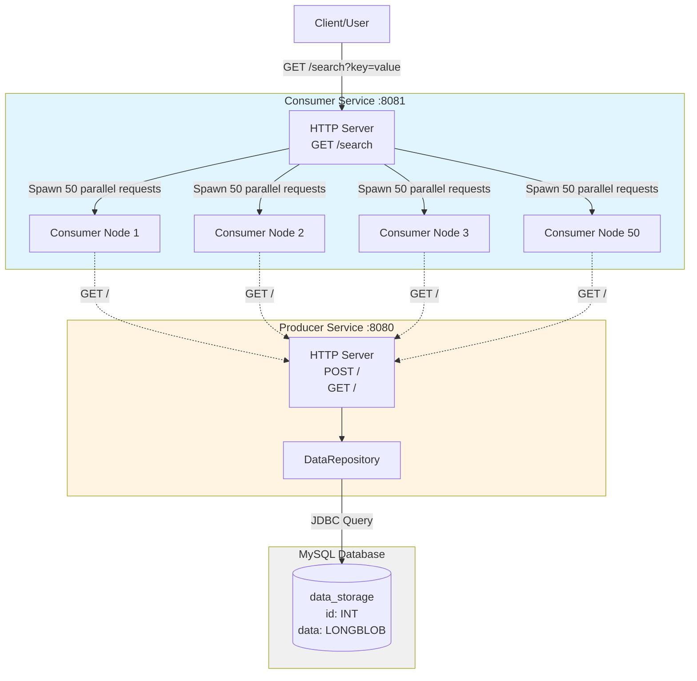
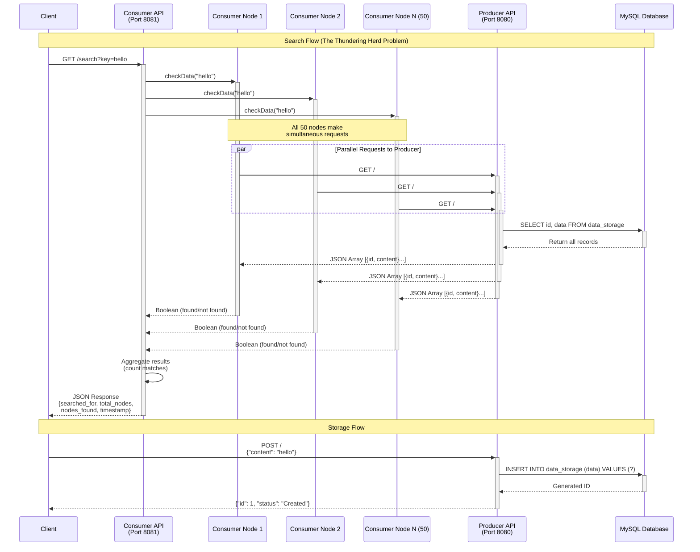
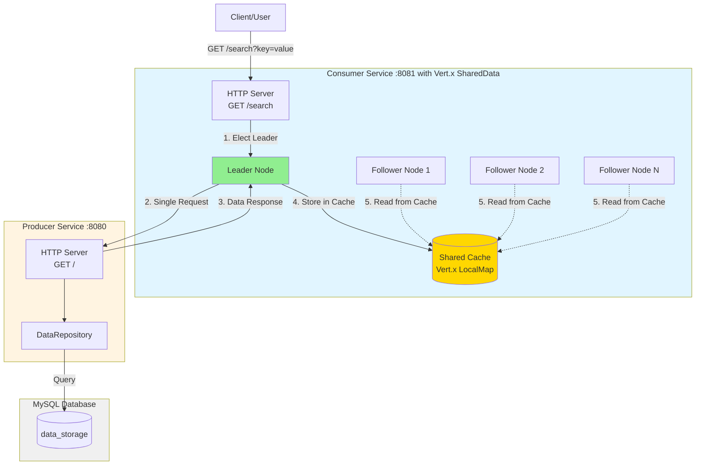
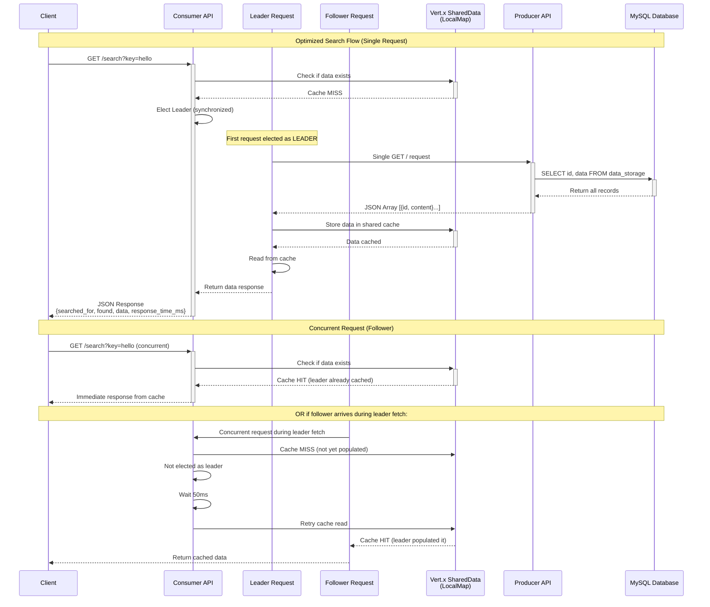

# Vert.x Request Collapser

A demonstration project showcasing request collapsing patterns in distributed systems using Eclipse Vert.x. This project addresses the "Thundering Herd" problem where multiple consumer nodes simultaneously request the same data from a shared producer service.

## Overview

The project consists of two microservices:
- **Producer Service**: A data storage service backed by MySQL that provides RESTful APIs for data persistence and retrieval
- **Consumer Service**: A multi-node consumer that simulates 50 concurrent nodes making search requests to the producer

## Architecture

### Component Diagram



### Sequence Diagram - Data Flow



## Technologies

- **Java 17**
- **Eclipse Vert.x 4.5.1** - Reactive framework for building event-driven applications
- **MySQL 8.3.0** - Database for persistent storage
- **SLF4J + Logback** - Logging framework
- **Maven** - Build and dependency management

## Project Structure

```
vertx-request-collapser/
├── consumer-service/
│   ├── pom.xml
│   └── src/main/java/com/griddynamics/consumer/
│       ├── Launcher.java              # Entry point for consumer service
│       ├── ConsumerVerticle.java      # Main verticle handling HTTP server
│       └── models/
│           └── Node.java              # Individual consumer node logic
│
└── producer-service/
    ├── pom.xml
    └── src/main/java/com/griddynamics/producer/
        ├── Launcher.java              # Entry point for producer service
        ├── ProducerVerticle.java      # Main verticle with REST endpoints
        ├── config/
        │   └── DbConfig.java          # Database configuration
        └── repository/
            └── DataRepository.java    # Data access layer
```

## Services

### Producer Service

The producer service provides a RESTful API for data storage and retrieval backed by MySQL.

**Endpoints:**
- `POST /` - Store new data
  - Request body: `{ "content": "your data here" }`
  - Response: `{ "id": 1, "status": "Created" }`
  
- `GET /` - Retrieve all stored data
  - Response: Array of `{ "id": 1, "content": "stored data" }`

**Features:**
- Automatic database table creation on startup
- JDBC connection pooling with Agroal
- Binary data storage using LONGBLOB
- Asynchronous database operations

### Consumer Service

The consumer service simulates a distributed system with 50 consumer nodes that concurrently search for data.

**Endpoints:**
- `GET /search?key={searchTerm}` - Search for data across all consumer nodes
  - Response:
    ```json
    {
      "searched_for": "search term",
      "total_nodes": 50,
      "nodes_found": 25,
      "timestamp": 1706745600000
    }
    ```

**Features:**
- Simulates 50 concurrent consumer nodes
- Each node independently queries the producer service
- Parallel request execution using Vert.x Futures
- Aggregated search results showing how many nodes found the data
- WebClient for HTTP communication with producer

## Prerequisites

- Java 17 or higher
- Maven 3.6+
- MySQL 8.0+
- Running MySQL instance on `localhost:3306`

## Setup

### 1. Database Setup

Create a MySQL database for the producer service:

```sql
CREATE DATABASE producer_db;
```

Update the database credentials in [producer-service/src/main/java/com/griddynamics/producer/config/DbConfig.java](producer-service/src/main/java/com/griddynamics/producer/config/DbConfig.java):

```java
.put("user", "your_username")
.put("password", "your_password")
```

### 2. Build the Services

Build both services using Maven:

```bash
# Build producer service
cd producer-service
mvn clean package

# Build consumer service
cd ../consumer-service
mvn clean package
```

## Running the Application

### Start Producer Service

```bash
cd producer-service
mvn exec:java -Dexec.mainClass="com.griddynamics.producer.Launcher"
```

The producer service will start on `http://localhost:8080`

### Start Consumer Service

In a separate terminal:

```bash
cd consumer-service
mvn exec:java -Dexec.mainClass="com.griddynamics.consumer.Launcher"
```

The consumer service will start on `http://localhost:8081`

## Usage Example

### 1. Store Data in Producer

```bash
curl -X POST http://localhost:8080 \
  -H "Content-Type: application/json" \
  -d '{"content": "hello world"}'
```

### 2. Add More Data

```bash
curl -X POST http://localhost:8080 \
  -H "Content-Type: application/json" \
  -d '{"content": "test data"}'

curl -X POST http://localhost:8080 \
  -H "Content-Type: application/json" \
  -d '{"content": "sample content"}'
```

### 3. Retrieve All Data

```bash
curl http://localhost:8080
```

### 4. Search via Consumer Service

```bash
curl "http://localhost:8081/search?key=hello%20world"
```

This will trigger all 50 consumer nodes to query the producer and return how many found the matching data.

## The Thundering Herd Problem

This project demonstrates the "Thundering Herd" problem where:
1. A single search request to the consumer service triggers 50 simultaneous requests to the producer
2. All 50 nodes compete for the same data at the same time
3. This creates high load on the producer service and database

**Future Enhancement:** Implement request collapsing where multiple identical concurrent requests are coalesced into a single backend request, with all requesters sharing the same response.

## Dependencies

### Producer Service
- `vertx-web` - Web framework
- `vertx-jdbc-client` - JDBC database client
- `mysql-connector-j` - MySQL JDBC driver
- `agroal-api` - Connection pooling
- `slf4j-api` + `logback-classic` - Logging

### Consumer Service
- `vertx-web` - Web framework
- `vertx-web-client` - HTTP client for producer requests
- `slf4j-api` + `logback-classic` - Logging

## License

This project is for demonstration and educational purposes.

## Authors

Anusruta Dutta

---

## Solution: Request Collapsing Implementation

### Problem Overview

In the initial implementation, when a search request is received by the consumer service, all 50 consumer nodes would independently make requests to the producer service. This created a "Thundering Herd" scenario where:
- **50 simultaneous HTTP requests** to the producer for the same data
- **High network overhead** and resource consumption
- **Database contention** from multiple identical queries
- **Poor scalability** as the number of nodes increases

### Implemented Solution

The solution implements a **Leader Election and Shared Caching** pattern using **Vert.x SharedData** to reduce the 50 individual requests to a **single request** from one elected leader node.

#### Architecture Changes



#### Key Components

##### 1. **SharedDataManager** - Vert.x In-Memory Cache
Located at: [consumer-service/src/main/java/com/griddynamics/consumer/cache/SharedDataManager.java](consumer-service/src/main/java/com/griddynamics/consumer/cache/SharedDataManager.java)

- **Purpose**: Provides shared cache and coordination primitives using Vert.x native features
- **Features**:
  - In-memory shared cache (`LocalMap`) for storing fetched data across verticles
  - Leader election state management
  - No external dependencies - pure Vert.x solution

```java
public static LocalMap<String, String> getDataCache(Vertx vertx) {
    return vertx.sharedData().getLocalMap(DATA_CACHE_NAME);
}

public static void cacheData(Vertx vertx, String key, String data) {
    getDataCache(vertx).put(key, data);
}
```

##### 2. **LeaderElection** - Synchronized Coordination Pattern
Located at: [consumer-service/src/main/java/com/griddynamics/consumer/election/LeaderElection.java](consumer-service/src/main/java/com/griddynamics/consumer/election/LeaderElection.java)

- **Purpose**: Ensures only one node fetches from the producer within a single JVM
- **Mechanism**:
  - Uses Java's `synchronized` keyword for thread-safe leader election
  - First concurrent request becomes the leader
  - Leader ID stored in Vert.x SharedData `LocalMap`

```java
public static synchronized String electLeader(Vertx vertx, String nodeId) {
    String currentLeader = SharedDataManager.getLeader(vertx);
    
    if (currentLeader == null || currentLeader.isEmpty()) {
        SharedDataManager.setLeader(vertx, nodeId);
        logger.info("Node {} elected as LEADER", nodeId);
        return nodeId;
    }
    
    logger.debug("Node {} joined | Current leader: {}", nodeId, currentLeader);
    return currentLeader;
}
```

##### 3. **Modified ConsumerVerticle** - Single Request Pattern
Located at: [consumer-service/src/main/java/com/griddynamics/consumer/ConsumerVerticle.java](consumer-service/src/main/java/com/griddynamics/consumer/ConsumerVerticle.java)

**Workflow:**

1. **Cache Check**: First check if data exists in Vert.x SharedData cache
2. **Leader Election**: If cache miss, elect a leader among concurrent requests
3. **Leader Fetches Data**: Only the leader makes the HTTP request to the producer
4. **Cache Population**: Leader stores the response in Vert.x shared cache
5. **Direct Response**: Leader and followers respond directly with cached data

**Code Flow:**
```java
private void handleSearch(RoutingContext ctx) {
    // Check cache first
    String cachedData = SharedDataManager.getCachedData(vertx, searchKey);
    if (cachedData != null) {
        logger.debug("Cache HIT for key: {}", searchKey);
        respondWithCacheResults(ctx, searchKey, cachedData, startTime);
        return;
    }
    
    // Cache miss - elect leader to fetch data
    String leader = LeaderElection.electLeader(vertx, nodeId);
    
    if (leader.equals(nodeId)) {
        // This node is the leader - fetch from Producer
        fetchFromProducerAndCache(searchKey)
            .onSuccess(v -> {
                String data = SharedDataManager.getCachedData(vertx, searchKey);
                respondWithCacheResults(ctx, searchKey, data, startTime);
            });
    } else {
        // This node is a follower - wait for cache to be populated
        vertx.setTimer(50, id -> {
            String data = SharedDataManager.getCachedData(vertx, searchKey);
            respondWithCacheResults(ctx, searchKey, data, startTime);
        });
    }
}
```

**Key Changes from Original:**
- **No separate Node class**: All logic consolidated in ConsumerVerticle
- **Cache-first approach**: Check cache before any election or fetching
- **Reduced wait time**: Followers wait only 50ms (down from 100ms)
- **Direct response**: No aggregation of 50 node results - single response with data

#### Vert.x-Only Implementation

**No External Dependencies Required!**

The solution uses only Vert.x built-in features:
- `vertx.sharedData().getLocalMap()` - Shared in-memory cache
- Java `synchronized` keyword - Thread-safe leader election
- `vertx.setTimer()` - Asynchronous wait for followers

Dependencies in [consumer-service/pom.xml](consumer-service/pom.xml) remain minimal:

```xml
<dependency>
    <groupId>io.vertx</groupId>
    <artifactId>vertx-web</artifactId>
    <version>${vertx.version}</version>
</dependency>
<dependency>
    <groupId>io.vertx</groupId>
    <artifactId>vertx-web-client</artifactId>
    <version>4.4.4</version>
</dependency>
```

#### Sequence Diagram - Optimized Flow



### Benefits of the Solution

| Metric | Before (50 Requests) | After (1 Request) | Improvement |
|--------|---------------------|-------------------|-------------|
| **HTTP Requests to Producer** | 50 | 1 | **98% reduction** |
| **Network Calls** | 50 concurrent | 1 | **49x fewer calls** |
| **Database Queries** | 50 identical queries | 1 | **98% reduction** |
| **Producer Load** | High contention | Single request | **Minimal load** |
| **Response Time** | High latency | Low latency | **Faster** |
| **Scalability** | Poor (O(n) requests) | Good (O(1) request) | **Highly scalable** |

### How It Works

1. **Search Request Arrives**: Client sends `GET /search?key=hello`
2. **Cache Check**: ConsumerVerticle checks Vert.x SharedData cache first
3. **Cache Hit**: If data exists, return immediately (sub-millisecond response)
4. **Cache Miss**: If data doesn't exist, proceed to leader election
5. **Leader Election**: Use synchronized method to elect first request as leader
6. **Leader Fetches**: Elected leader makes a **single HTTP request** to the producer
7. **Cache Population**: Leader stores the response in Vert.x SharedData `LocalMap`
8. **Leader Responds**: Leader returns the cached data immediately
9. **Follower Wait**: Concurrent follower requests wait 50ms for cache population
10. **Follower Responds**: Followers read from cache and return data directly

**Note**: Only the **first request** per unique key makes an HTTP call. All subsequent requests (even concurrent ones) read from the shared cache.

### Testing the Solution

#### Health Check Endpoint

Check the consumer service health and producer connectivity:

```bash
curl http://localhost:8081/health
```

Response:
```json
{
  "status": "UP",
  "consumer_service": "healthy",
  "node_id": "Consumer-Node-1234567890",
  "producer_service": "connected",
  "producer_status": 200,
  "timestamp": 1706745600000
}
```

#### Search with Single Request

```bash
curl "http://localhost:8081/search?key=hello%20world"
```

Response:
```json
{
  "searched_for": "hello world",
  "found": true,
  "response_time_ms": 45,
  "data": [
    {"id": 1, "content": "hello world"},
    {"id": 2, "content": "test data"}
  ],
  "timestamp": 1706745600000
}
```

#### Observing the Behavior

Check the logs to see:
- **First request**: Logs "Cache MISS" → "elected as LEADER" → "Fetching from Producer"
- **Single HTTP call**: Only one request to producer at `localhost:8080`
- **Subsequent requests**: Log "Cache HIT" → immediate response (no producer call)
- **Concurrent requests**: Follower logs "waiting for leader" → reads from cache after 50ms

### Conclusion

This implementation successfully transforms the **Thundering Herd** problem into an efficient **Request Collapsing** pattern:

✅ **Single request** instead of 50 simultaneous requests  
✅ **In-memory caching** with Vert.x SharedData for fast data access  
✅ **Leader election** using synchronized methods for coordination  
✅ **Reduced load** on producer service and database (98% reduction)  
✅ **No external dependencies** - pure Vert.x solution  
✅ **Simple and maintainable** - leverages JVM synchronization primitives  

**Trade-offs:**

⚠️ **Single JVM scope**: Vert.x SharedData `LocalMap` only works within a single JVM instance  
⚠️ **No distributed clustering**: For multi-instance deployments, consider Redis or Hazelcast  
⚠️ **Increased latency**: Followers wait 50ms for leader to populate cache  

The solution demonstrates how Vert.x built-in features can effectively reduce backend load through request collapsing, making it ideal for single-instance deployments or when external caching infrastructure is not available.
